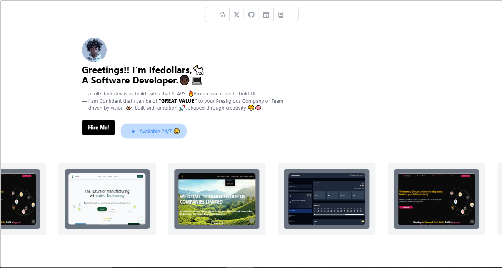

## ✅ MyProjectName
This project is name is called Ifedollars Portfolio.

# Portolio 



# Summary
A bold, modern portfolio showcasing my frontend skills, design sense, and real-world projects. Built with Vue.js and Tailwind CSS, it reflects my style, attention to detail, and passion for building websites that stands out.

## ✨ Features
The portfolio includes the following powerful and polished features:

📍 Location Search
Autocomplete-enabled city search with worldwide coverage and precise weather details

🌤️ Current Conditions
Displays real-time temperature, feels-like, humidity, wind speed, and visibility

📡 Live Updates
Automatically refreshes data to keep conditions up to date

🌅 Sunrise & Sunset Times
Elegant display of golden hour and daily transition moments

🌡️ Air Quality Index (AQI)
PM2.5 levels shown with intuitive color coding for quick health reference

📱 Fully Responsive Design
Optimized layout that adapts seamlessly to mobile, tablet, and desktop screens

## 🛠️ Technologies Used

| Category        | Technologies                          |
|-----------------|---------------------------------------|
| 🖥️ Frontend     | Vue 3, Tailwind CSS, Hero Icons       |
| 🎨 Styling      | Tailwind CSS, Custom Gradients, AOS   |
| 🚀 Build Tools  | 	Vite                                |
| 🧠 State Mgm    | VueUse                                | 
| 💌 Form Handlin | Formspree(for contact form submissions)|
| 🌍 Deployment   | Vercel                                 |

## 🚀 Installation

1. Clone the repository:
   ```bash
   git clone https://github.com/yourusername/project-dashboard.git

## 🤝 Contributing
Contributions are welcome!  
Please fork the repo and create a pull request.
1. Fork the Project  
2. Create your Feature Branch (`git checkout -b feature/AmazingFeature`)  
3. Commit your Changes (`git commit -m 'Add some AmazingFeature'`)  
4. Push to the Branch (`git push origin feature/AmazingFeature`)  
5. Open a Pull Request


## 📬 Contact
Made by @Ifedollars99
**Hamzah Taofeeq ifedolapo**  
📧 taofeeqifedollar@gmail.com  
🔗 [LinkedIn](https://www.linkedin.com/in/taofeeq-ifedolapo-7890162ba?utm_source=share&utm_campaign=share_via&utm_content=profile&utm_medium=android_app) 
| [Twitter](https://x.com/IfedollarsAvr?t=KWrkgQdZLuh7Y7xaCLCWeg&s=09)
# Ghost of the System 👻

