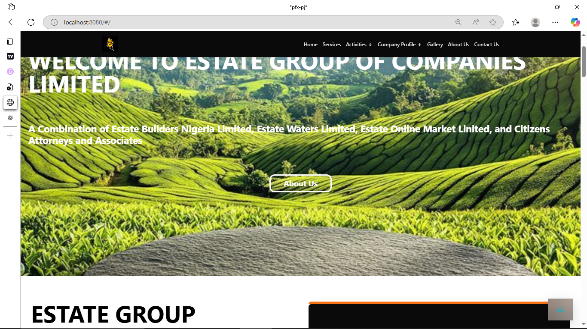

## ✅ MyProjectName
This project is names Estate project

## ✅ Summmary
A responsive web application that showcases estate properties efficiently with a sleek, intuitive interface built using Vue.js and Tailwind CSS.

## ✅ Features
- User-Friendly
- Responsive design for all screen sizes
- Mobile-first interface
- Smooth animations using Animate.css

## 🛠 Tech Stack
**Frontend:** Vue 3, Tailwind CSS, Animate.css  

## 📸 Screenshot

## 🤝 Contributing
Contributions are welcome!  
Please fork the repo and create a pull request.
1. Fork the Project  
2. Create your Feature Branch (`git checkout -b feature/AmazingFeature`)  
3. Commit your Changes (`git commit -m 'Add some AmazingFeature'`)  
4. Push to the Branch (`git push origin feature/AmazingFeature`)  
5. Open a Pull Request

## 📬 Contact
Made by @Ifedollars99
**Hamzah Taofeeq ifedolapo**  
📧 taofeeqifedollar@gmail.com  
🔗 [LinkedIn](https://www.linkedin.com/in/taofeeq-ifedolapo-7890162ba?utm_source=share&utm_campaign=share_via&utm_content=profile&utm_medium=android_app) 
| [Twitter](https://x.com/IfedollarsAvr?t=KWrkgQdZLuh7Y7xaCLCWeg&s=09)
# Ghost of the System 👻

