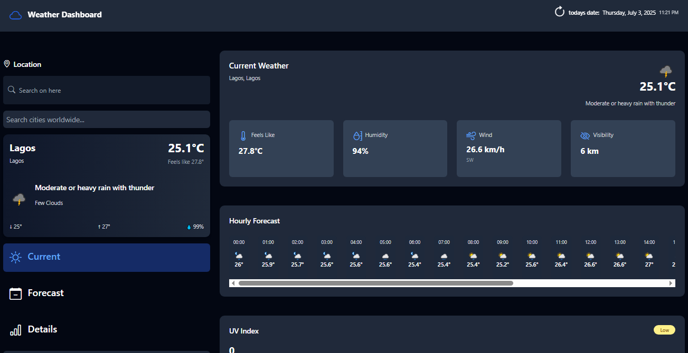

## ✅ MyProjectName
This project is name is called Weather project.

# 🌦️ Weather Dashboard



# Summary
An elegant, real-time weather application with beautiful visuals and accurate forecasts worldwide. Built with Vue.js and the WeatherAPI.

## ✨ Features
The features are listed as of below 
- **📍 Location Search**  
  Autocomplete for cities worldwide with detailed weather information
- **🌤️ Current Conditions**  
  Temperature, feels-like, humidity, wind speed, and visibility
- **📡 Live Updates**  
  Real-time weather data refresh
- **🌅 Sunrise/Sunset**  
  Beautifully displayed golden hour times
- **🌡️ Air Quality Index**  
  Color-coded PM2.5 monitoring
- **📱 Fully Responsive**  
  Works flawlessly on all devices

## 🛠️ Technologies Used

| Category        | Technologies                          |
|-----------------|---------------------------------------|
| Frontend        | Vue 3, Tailwind CSS, Hero Icons       |
| API             | WeatherAPI                            |
| Build Tools     | Vite                                  |

## 🚀 Installation

1. Clone the repository:
   ```bash
   git clone https://github.com/yourusername/weather-dashboard.git

## 🤝 Contributing
Contributions are welcome!  
Please fork the repo and create a pull request.
1. Fork the Project  
2. Create your Feature Branch (`git checkout -b feature/AmazingFeature`)  
3. Commit your Changes (`git commit -m 'Add some AmazingFeature'`)  
4. Push to the Branch (`git push origin feature/AmazingFeature`)  
5. Open a Pull Request


## 📬 Contact
Made by @Ifedollars99
**Hamzah Taofeeq ifedolapo**  
📧 taofeeqifedollar@gmail.com  
🔗 [LinkedIn](https://www.linkedin.com/in/taofeeq-ifedolapo-7890162ba?utm_source=share&utm_campaign=share_via&utm_content=profile&utm_medium=android_app) 
| [Twitter](https://x.com/IfedollarsAvr?t=KWrkgQdZLuh7Y7xaCLCWeg&s=09)
# Ghost of the System 👻

